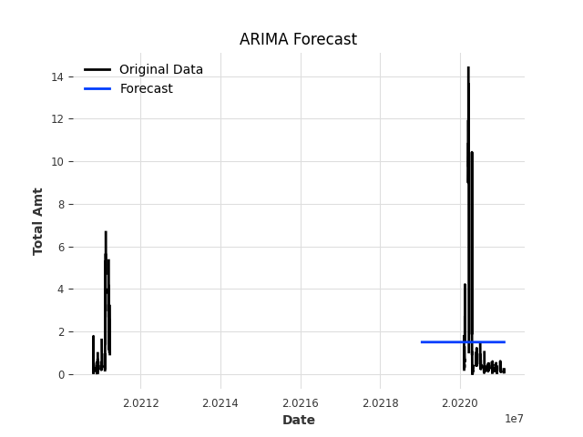

# Time series forecasting on transaction data using the Darts library

This approach allows for a visual comparison of the ARIMA model's forecast against the actual transaction amounts, helping to evaluate the model's performance.

The below plot is of the original data along with the forecasted values. The original data is displayed with one label, while the forecasted values are displayed with another, making it easy to compare the model's predictions with the actual data. The plot includes labeled axes and a title for clarity, and a legend to distinguish between the original data and the forecast.

