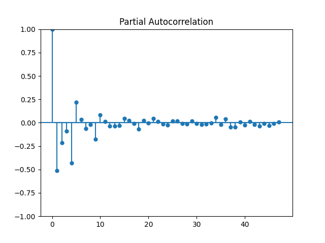
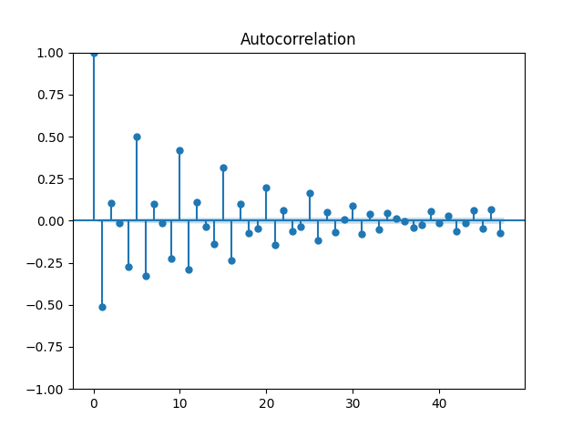

#  Time series analysis and forecasting using the ARIMA model with Statsmodels 

# ACF and PACF Plots
The Auto-Correlation Function (ACF) and Partial Auto-Correlation Function (PACF) of the differenced data to help determine the appropriate order of the ARIMA model's parameters (p, d, q).

The output includes:
- ACF and PACF plots that help identify the AR and MA terms.
- The plots show the original transaction data along with the ARIMA model's 
  forecast, visually representing the model's prediction of future values.

